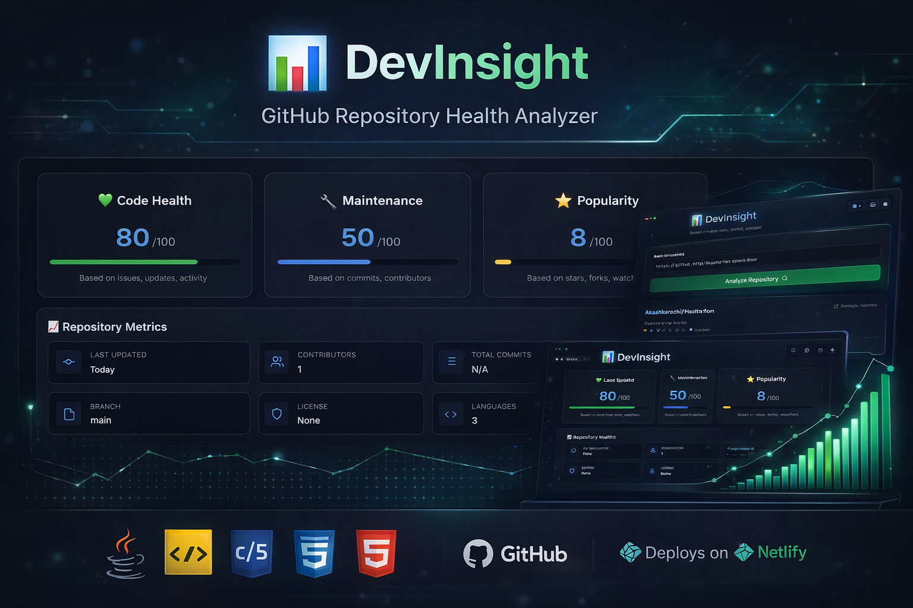
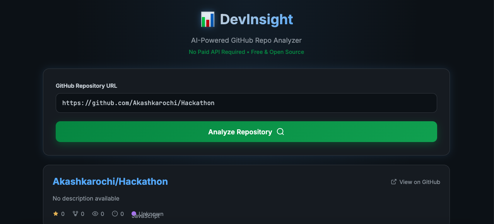

<p align="center">
  
</p>

<h1 align="center">DevInsight</h1>
<h3 align="center">AI-Powered GitHub Repository Health Analyzer</h3>

<p align="center">
  
</p>

---

## 🏆 Badges

<p align="center">


</p>

---

# 🌐 Live Demo

🔗 https://gregarious-medovik-528512.netlify.app/

---

# 🖥️ Application Preview

<p align="center">
  <a href="https://gregarious-medovik-528512.netlify.app/" target="_blank">
    
    
  </a>
</p>

---

# 📌 Problem

Developers often rely on fragmented GitHub metrics to evaluate repository quality. There is no structured, unified health scoring system.

DevInsight solves this by aggregating repository data and generating a composite health score.

---

# ⚡ Features

- Real-time GitHub API Integration  
- Repository Health Score Engine  
- Popularity & Maintenance Metrics  
- Contributor & Commit Tracking  
- Responsive UI  
- Lightweight & Fast  

---

# 🛠️ Tech Stack

### Frontend
- HTML5  
- CSS3  
- JavaScript  

### Backend
- Java  
- REST API  
- GitHub Public API  

### Deployment
- Netlify  

---

# 🧠 Architecture

```text
User Input
    ↓
Frontend (HTML/CSS/JS)
    ↓
Java Backend API
    ↓
GitHub REST API
    ↓
Data Processing Layer
    ↓
Health Score Algorithm
    ↓
Insights Dashboard
```


📊 Health Score Model

Health score is calculated using weighted metrics:

Issue Resolution Ratio

Commit Frequency

Contributor Engagement

Popularity (Stars/Forks)

Update Recency

📈 Developer Activity

🚀 Future Roadmap

AI-powered repository recommendations

Interactive data visualizations

Authentication & saved history

Exportable analytics reports

👨‍💻 Author

Akash Karochi
Full Stack Web Developer

<p align="center"> <a href="https://www.linkedin.com/">  </a> <a href="https://gregarious-medovik-528512.netlify.app/">  </a> </p>
<p align="center"> ⭐ If you found this project useful, consider giving it a star! </p>
